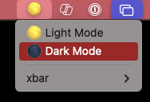

# macos-toggle-dock
> CLI utility to toggle dock hiding along with an installable Xbar plugin.

> Toggling the dock only works on MacOS ⚠️



Installation:

```bash
$ cargo install --git https://github.com/allovelle/macos-toggle-dock
```

For convenience, use this [Xbar](https://xbarapp.com) script to put a clickable icon in the menu
bar:

```bash
#!/usr/bin/env bash

export PATH="$HOME/.cargo/bin:$PATH"

echo ':peach:'  # More Emojis: https://gist.github.com/rxaviers/7360908
echo '---'
echo "Toggle Dock | shell='$(which macos-toggle-dock)'"
```

Put the Xbar script in `~/Library/Application\ Support/xbar/plugins` and don't
forget to make it executable with `chmod +x toggle-hide-dock.sh`.

For convenience, this crate adds a CLI command to do this automatically:

```bash
$ macos-toggle-dock install
$ macos-toggle-dock uninstall
```
